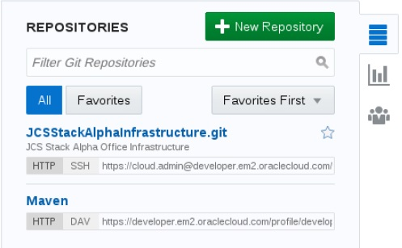

---
# ORACLE Cloud-Native DevOps workshop #

## Creating DB Schema, Loading Application Data and Creating Weblogic DataSource ##

### Introduction ###

This lab goes through the process of loading application data into DBCS. First we would create a Application specific user in DBCS after which we would be creating required tables and loading the application data. 

Once the data loading is complete we would create a DataSocurce in weblogic using which application can access the data.

### Prerequisites ###

+ Oracle DevCS account access
+ Oracle DBCS access

### Steps ###

1. Clone the Alpha office source code using DevCS 
2. Creating DB schema and loading data
3. Creating weblogic DataSource

#### 1. Log into your Cloud Account ####

+ Click Sign In from cloud.oracle.com

+ From the next page select the appropriate Data Center from the dropdown and click **My Services**

+ In the next screen provide the appropriate identity Domain assigned to you and login using the username password provided.

##### 2. Create a Project in Developer Cloud Service #####

Oracle Developer Cloud Service provides a complete development platform that streamlines team development processes and automates software delivery. The integrated platform includes an issue tracking system, agile development dashboards, code versioning and review platform, continuous integration and delivery automation, as well as team collaboration features such as wikis and live activity stream. With a rich web based dashboard and integration with popular development tools, Oracle Developer Cloud Service helps deliver better applications faster.

+	Open Developer Cloud Service console
+	From the Cloud UI dashboard click on the **Developer** service. In our example, the Developer Cloud Service is named **developer#####**.

+	Click on **Open Service Console** 

+ Click **New Project** to start the project create wizard. **Note:** Depending on the status of your developer cloud service, it is possible that the button may be labeled **Create Project**

+ On Details screen enter the following data and click on **Next**.

**Name:** `Alpha Office`

**Description:** `Alpha Office Product Catalog`

+ Leave default template set to **Empty Project** and click **Next**

+ Select your **Wiki Markup** preference to **MARKDOWN** and click **Finish**.

+ The Project Creation will take about 1 minute.

##### 3. Create Initial GIT Repository  #####

+ Click on **New Repository** to create a new Git Repository.

+	In the New Repository wizard enter the following information and click **Create**.

**Name:** `AlphaOfficeProductCatalogUI`

**Description:** `Alpha Office Product Catalog UI`

**Initial content:** `Import existing repository`

**Enter the URL:** `https://github.com/dvukmano/cloud-native-devops-workshop.git`

##### 4. Creating DB Schema and Loading Application Data #####

Before you start loading data into the Database, the SQL port 1521 of your DBCS instace will be diabled by default.

Follow the below steps to enable the port for your appliaction access.

+ Login to your cloud account and click on **Database** from the dashboard

+	Click on **Open Service Console** 

•	Select the hamburger symbol to the right of DBCS instance **Alpha01A-DBCS** and select **Access Rules**

+ Select the hamburger symbol to the right of your of rule **ora_p2_dblistener** and select **Enable**

+ Select **Enable** in the popup screen.

+ Open **Developer cloud Service** and click on the **Project** you have created **Alpha Office**

+ On navigation panel, click **Build** to access the build page and click **New Job**.

+ Give the Job Name as `DBBuild` and click **Save**

+ Click on **Source Control** and select **Git**

+ Under **Repository** select 'AlphaOfficeProductCatalogUIdvuk.git'

+ Click on **Build Steps**

+ Click **Add Build Step**  and select **Invoke SQLcl**

+ Enter the following details

**Username:** `system`

**Password:** `Give the DBCS instance password`

**Credentials File:** `leave it blank`

**Connect String:** `<public IP of DBCS insatce>:1521:ORCL`

**Source:** `SQL File` 

**SQL File Path:** `AlphaOfficeProductCatalogUI/AlphaProducts/ConfigFiles/DB/createUserAlpha.sql`

+ Click **Add Build Step**  and select **Invoke SQLcl**

+ Enter the following details

**Username:** `c##alpha`

**Password:** `Alpha2017_`

**Credentials File:** `leave it blank`

**Connect String:** `<public IP of DBCS insatce>:1521:ORCL`

**Source:** `SQL File` 

**SQL statements:** `AlphaOfficeProductCatalogUI/AlphaProducts/ConfigFiles/DB/createProducts.sql`

+ Click **Save**

+ In the next screen click **Build Now**

##### 5. Creating Weblogic DataSource #####

+ Login to your cloud account and click on **Java** from the dashboard

+ Click on **Open Service console** in the next page

+ Select the hamburger symbol to the right of your JCS instance and select **Open Weblogic Server Console**

+ Log into Weblogic sever console with the `Username / Password` provided

+ From the left pane expand **Services** and select **Data Sources**

+ Click on **New** and then select **Generic Data Source**

+ Provide the following details in the next screen and click Next

**Name:** `AlphaProductsDB`

**JNDI Name:** `jdbc/Alpha01A-DBCS-ds-CanDo`

**Database type:** `Oracle`

+	Leave all the values as default and click **Next**

+	Leave all the values as default and click **Next**

+ Give the following Connection Properties in the next screen and click **Next**

**Database Name:** `ORCL`

**Host name:** `<Public IP address of DBCS>`

**Port:** `1521`

**Database User Name:** `c##alpha`

**Password:** `Alpha2017_`

+ Change the Connection URL to the format below and click **Test Connection**

 `jdbc:oracle:thin:@< Public IP address of DBCS>:1521:ORCL`
 
 

•	In the next screen select **All Servers in the Cluster** and click **Finish**

 

