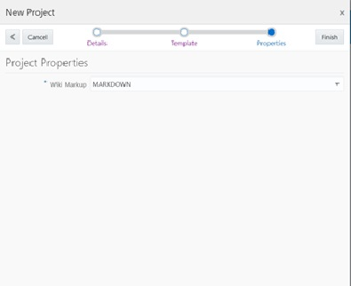
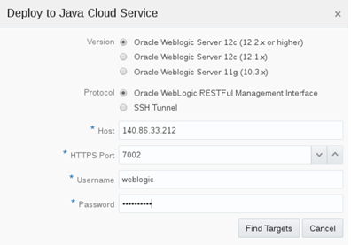
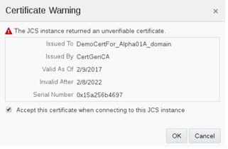
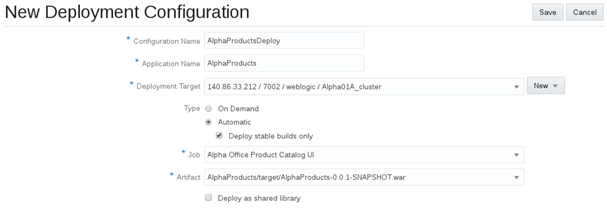
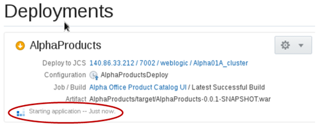
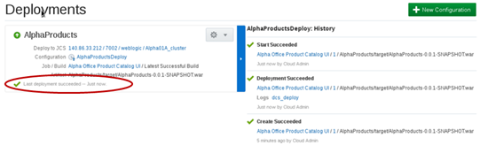
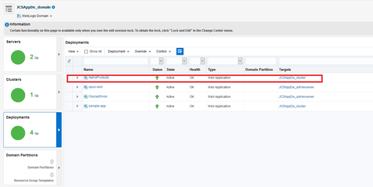
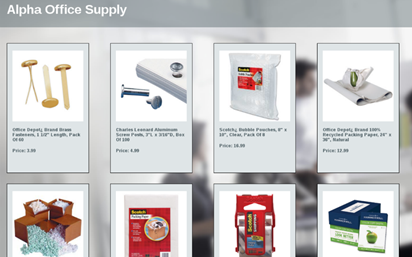

---
# ORACLE Cloud-Native DevOps workshop #

## Deploy J2EE Application on JCS using DevCS & DBCS ##

### Introduction ###

The Oracle Java Cloud Service (JCS) provides a cloud-based application server (Oracle WebLogic Server with automated customer-controlled provisioning, backup, patching, scaling with cloud tooling) designed to support any Java application. You may use the Oracle Java Cloud Service through the Oracle Java Cloud Service console and quickly create and configure Java EE application environment.

### About this tutorial ###
This tutorial demonstrates how to:
	
+ Deploy an Application on JCS using DevCS

### Prerequisites ###

+ Oracle Java Cloud Service uses Oracle Database Cloud Service to host the Oracle Fusion Middleware component schemas required by Oracle Java Required Files (JRF).
+ Oracle DevCS account access
+ Oracle DBCS access

### Steps ###

There are three major steps in order to deploy an Applcation on JCS:
1. Clone and build the Alpha office source code using DevCS 
2. Load application data into DBCS 
3. Deploy the application in JCS using DevCS

#### 1. Log into your Cloud Account ####

+ Click Sign In from cloud.oracle.com

+ From the next page select the appropriate Data Center from the dropdown and click My Services

+ In the next screen provide the appropriate identity Domain assigned to you and login using the username password provided.

##### 2. Create a Project in Developer Cloud Service #####

Oracle Developer Cloud Service provides a complete development platform that streamlines team development processes and automates software delivery. The integrated platform includes an issue tracking system, agile development dashboards, code versioning and review platform, continuous integration and delivery automation, as well as team collaboration features such as wikis and live activity stream. With a rich web based dashboard and integration with popular development tools, Oracle Developer Cloud Service helps deliver better applications faster.

+	Open Developer Cloud Service console
+	From the Cloud UI dashboard click on the Developer service. In our example, the Developer Cloud Service is named developer#####.

+	Click on Open Service Console 

+ Click New Project to start the project create wizard. Note: Depending on the status of your developer cloud service, it is possible that the button may be labeled Create Project

+ On Details screen enter the following data and click on Next.

`Name: Alpha Office`

`Description: Alpha Office Product Catalog`

+	Leave default template set to Empty Project and click Next

+ Select your Wiki Markup preference to MARKDOWN and click Finish.

+ The Project Creation will take about 1 minute.

##### 3. Create Initial GIT Repository  #####

+	Click on New Repository to create a new Git Repository.

+	In the New Repository wizard enter the following information and click Create.

`Name: AlphaOfficeProductCatalogUI`

`Description: Alpha Office Product Catalog UI`

`Initial content: Import existing repository`

`Enter the URL: https://github.com/jsudeesh/AlphaOfficeProductCatalogUI.git`

##### 4. Creating a Build Process   #####

Now that we have the source code in our managed GIT repository, we need to create a build process that will be triggered whenever a commit is made to the master branch. We will set up a Maven build process in this section.

+ On navigation panel, click Build to access the build page and click New Job.

+ In the New Job popup enter `Alpha Office Product Catalog UI` for the Job Name, and then click Save.

+ You are now placed into the job configuration screen.

+ On the Main tab on the Configure Build screen change the JDK drop down to JDK8.

+ Click the Source Control tab. Click Git and select AlphaOfficeProductCatalogUI.git from the drop down.

+ Click the Triggers tab. Select Based on SCM polling schedule.

+ Click the Build Steps tab. Click Add Build Step, and select Invoke Maven 3.

+ In the Maven Build Step set the following:

`Goal: clean -Dmaven.test.skip=true install`

(Note: This new Goal will allow integration tests to be run after the deployment of the application)

`POM File: AlphaProducts/pom.xml`

+ Click the Post Build tab. Check Archive the artifacts and enter `**/AlphaProducts/target/*` for the Files to Archive.

+ Click Save to complete the configuration.

+ Click the Build Now button to start the build. This will trigger for the build to be placed in the build queue.

+ After the build is successful you will be able to see the artifacts from the build process as shown below

##### 5. Deploy the application you built into JCS instance #####

+ Switch over to browser tab for cloud services. Click on the far left navigation icon and select Oracle Java Cloud Service.

+ The Java Cloud Service console shows all the provisioned instances of JCS. You should see the instance XXXXXXXX which you would have provisioned in earlier workshop.

+ Click on XXXXXXX to view the details of the service. Copy down the Public IP to be used later in the lab.

+ Expand the Load Balancer section and copy down the Aliases to be used later in the workshop.

+ Switch back to Developer Cloud Service. On the navigation panel click Deploy to access the Deployment page. Click New Configuration

+ Enter the following data:

`Configuration Name: AlphaProductsDeploy`

`Application Name: AlphaProducts`

+ To the right of the Deployment Target, click New and select Java Cloud Service

+ Enter the following data:

`Host: <Public IP for JCS Service capture in previous step>`

`Username: weblogic`

`Password: <Password provided during JCS instance creation>`

+ Click Find Targets. Check Accept this certificate when connecting to the JCS instance and click OK

+ Check XXXXX_cluster to deploy to the entire cluster and click OK

+ Set the following Properties and click Save

`Type: Automatic and check Deploy stable builds only`

`Job: Alpha Office Product Catalog UI`

+ Click drop down and select Start

+ Wait until the message Starting application changes to Last deployment succeeded

+ Check the deployment status in the weblogic EM console

     o Open a browser and go to https://<public ip of JCS instance>:7002/em
	
     o Login using the weblogic credentials
	
     o Click on the Deployments tab on the left hand side
	
+ Check the status of AlphaProducts deployment 

+ Open a new tab in the browser and enter the following URL: `https://<Public IP of Load Balancer>/AlphaProducts`

+ On the security warning click ADVANCED and then click Proceed to ...

+ You should now see the Alpha Office Product Catalog UI

