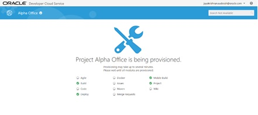

---
# ORACLE Cloud-Native DevOps workshop #

## Deploy J2EE Application on JCS using DevCS & DBCS ##

### Introduction ###

The Oracle Java Cloud Service (JCS) provides a cloud-based application server (Oracle WebLogic Server with automated customer-controlled provisioning, backup, patching, scaling with cloud tooling) designed to support any Java application. You may use the Oracle Java Cloud Service through the Oracle Java Cloud Service console and quickly create and configure Java EE application environment.

### About this tutorial ###
This tutorial demonstrates how to:
	
+ Deploy an Application on JCS using DevCS

### Prerequisites ###

+ Oracle Java Cloud Service uses Oracle Database Cloud Service to host the Oracle Fusion Middleware component schemas required by Oracle Java Required Files (JRF).
+ Oracle DevCS account access
+ Oracle DBCS access

### Steps ###

There are three major steps in order to deploy an Applcation on JCS:
1. Clone and build the Alpha office source code using DevCS 
2. Load application data into DBCS 
3. Deploy the application in JCS using DevCS

#### 1. Log into your Cloud Account ####

+ Click Sign In from cloud.oracle.com

+ From the next page select the appropriate Data Center from the dropdown and click My Services

+ In the next screen provide the appropriate identity Domain assigned to you and login using the username password provided.

##### 2. Create a Project in Developer Cloud Service #####

Oracle Developer Cloud Service provides a complete development platform that streamlines team development processes and automates software delivery. The integrated platform includes an issue tracking system, agile development dashboards, code versioning and review platform, continuous integration and delivery automation, as well as team collaboration features such as wikis and live activity stream. With a rich web based dashboard and integration with popular development tools, Oracle Developer Cloud Service helps deliver better applications faster.

+	Open Developer Cloud Service console
+	From the Cloud UI dashboard click on the Developer service. In our example, the Developer Cloud Service is named developer#####.

+	Click on Open Service Console 

+ Click New Project to start the project create wizard. Note: Depending on the status of your developer cloud service, it is possible that the button may be labeled Create Project

+ On Details screen enter the following data and click on Next.

`Name: Alpha Office`

`Description: Alpha Office Product Catalog`

+	Leave default template set to Empty Project and click Next

+ Select your Wiki Markup preference to MARKDOWN and click Finish.

+ The Project Creation will take about 1 minute.

##### 3. Create Initial GIT Repository  #####

+	Click on New Repository to create a new Git Repository.

+	In the New Repository wizard enter the following information and click Create.

`Name: AlphaOfficeProductCatalogUI`

`Description: Alpha Office Product Catalog UI`

`Initial content: Import existing repository`

`Enter the URL: https://github.com/jsudeesh/AlphaOfficeProductCatalogUI.git`

##### 4. Creating a Build Process   #####

Now that we have the source code in our managed GIT repository, we need to create a build process that will be triggered whenever a commit is made to the master branch. We will set up a Maven build process in this section.

+ On navigation panel, click Build to access the build page and click New Job.

