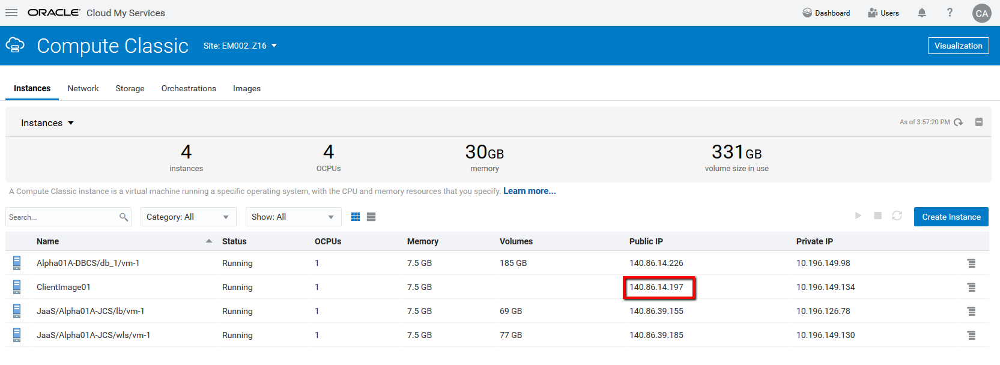
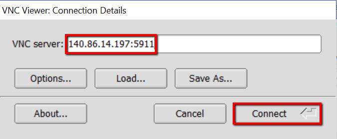

# Client Image users (compute running on OCI-C):
## TigerVNC:

The latest release of TigerVNC can be downloaded from our [GitHub release page](https://github.com/TigerVNC/tigervnc/releases).

Binaries are available from bintray: https://bintray.com/tigervnc/stable/tigervnc/1.8.0

Once when you installed TigerVNC or any other VNC viewer we need Client Image public IP address. Client Image is compute running on Oracle Public Cloud and here are the steps to find its public IP address:

- on dashboard click on Compute instances


- on compute instances list you can find public IP for Client Image


- connect to Client Image using VNC viewer ```<ClientImageIP:5911>``` or ```<ClientImageIP:5910>``` for lower resolution if there are bandwith issue, in our exapmple we will connect with ```140.86.14.197:5911```, password is the same password for cloud.admin user


- and we are connected


# Personal Laptop users:
## Client Tools prerequisites:

- JDK 8
- Maven 
- Git client
- Eclipse + Git Plugin
- Python 3.3 or later
