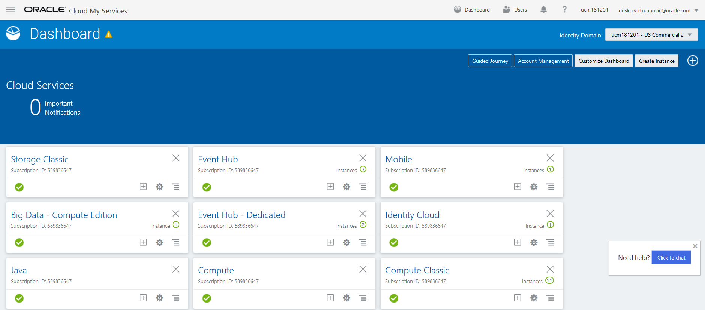
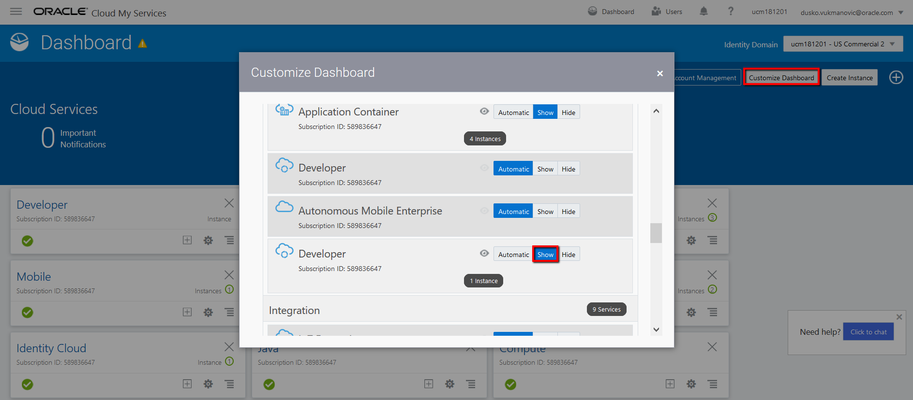
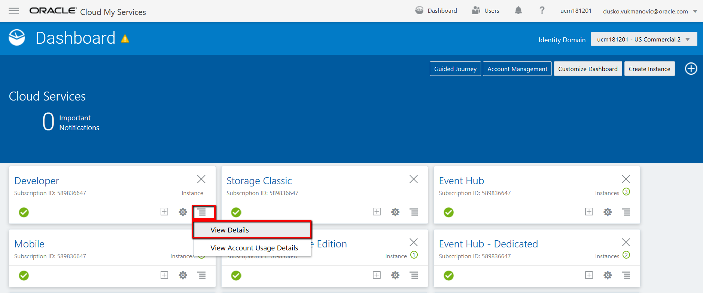
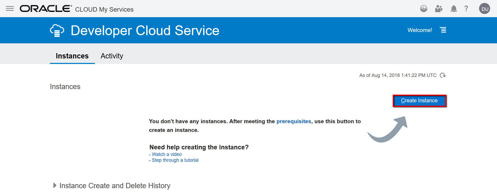
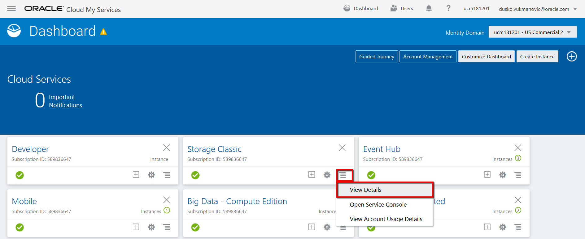
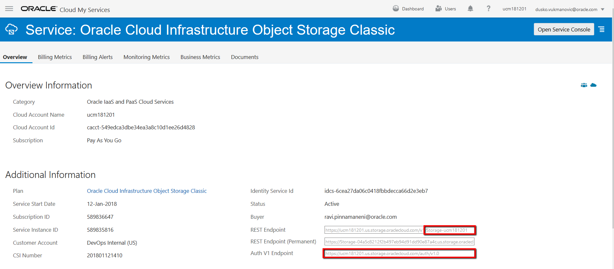

### New Developer Cloud Service Setup ###

Oracle Developer Cloud Service now supports integration with Oracle Cloud Infrastructure Compute Classic and Oracle Cloud Infrastructure Object Storage Classic.

You can create virtual machines (VMs) on Oracle Cloud Infrastructure Compute Classic and use them to run builds of your projects. The archived build artifacts and Maven artifacts are stored on the containers of Oracle Cloud Infrastructure Object Storage Classic.

After sign in, if Oracle Developer Cloud Service isn't listed on the dashboard, click **Customize Dashboard.** Under **Platform,** find **developer _id_,** click **Show,** and then close the **Customize Dashboard** window.

If you see two DevCS services, choose 2nd, and then you can close Dialog window.

Now go to DevCS instance, on the My Services Dashboard page, in the **developer _id_** tile, click **Action** and select **View Details**

On the upper right corner, click on Open Service Console.

If this is first time you access DevCS than you will have to create instance, click on create instance button:

Only parameter you should define is an instance name, click Next and Confirm:

After few minutes instance will be ready and you can access to DevCS.

In order to projects becomes fully functional, you have to configure Compute, Storage and create Build VM. Here are four steps for DevCS setup (all details are on the links, here are just specifics for our lab):

1. [Configure a connection to Oracle Cloud Infrastructure Storage Classic](http://www.oracle.com/webfolder/technetwork/tutorials/obe/cloud/developer/config_compute_storage/devcs_config_storage.html)

In order to collect information needed for Storage setup go to Storage Classic instance and View Details

Here you can find related Storage information:

Here you configure Storage connection:

2. [Configure a connection to Oracle Cloud Infrastructure Compute Classic](http://www.oracle.com/webfolder/technetwork/tutorials/obe/cloud/developer/config_compute_storage/devcs_config_compute.html)

In order to collect Compute information, go to Compute Classic instance and View Details wher you can find related Compute information:

Here you configure Compute connection:

3. [Create a Build VM template](http://www.oracle.com/webfolder/technetwork/tutorials/obe/cloud/developer/config_buildvm/devcs_create_buildvmtemplate.html)

Name: myLabTemplate
Platform: Oracle Linux 7
Software: Include SQLcl 4 - SQL command line interface (Already included: Git, Java, JUnit, Maven, Ruby and Ant.)

4. [Add Build VMs](http://www.oracle.com/webfolder/technetwork/tutorials/obe/cloud/developer/config_buildvm/devcs_create_buildvm.html)

Quantity: 1
VM Template: myLabTempate

You are ready to create new project and start your DevOps process.
