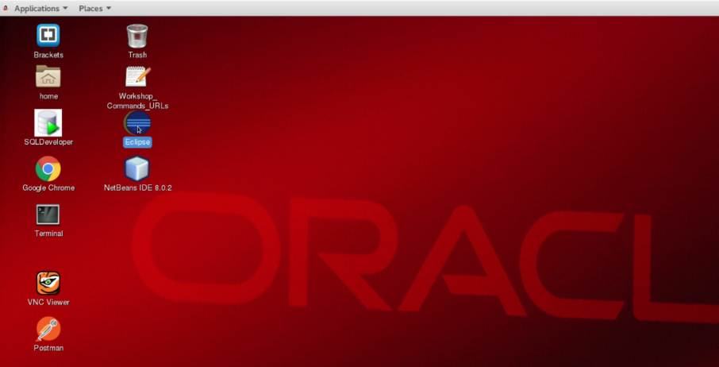
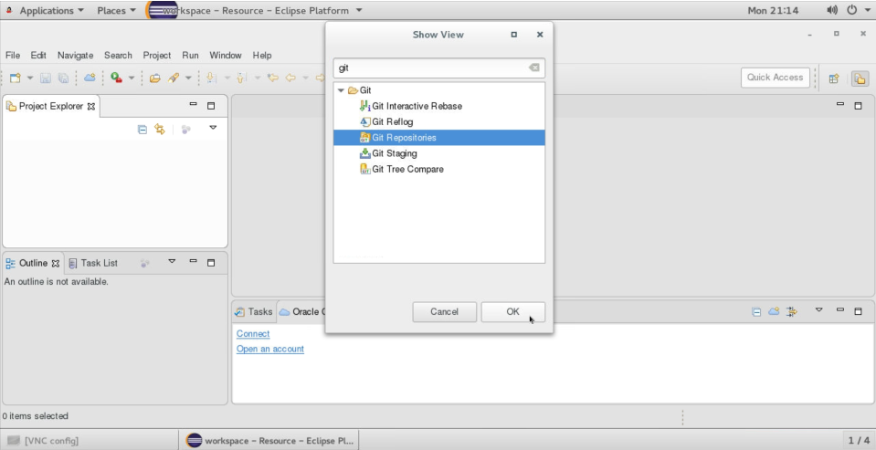
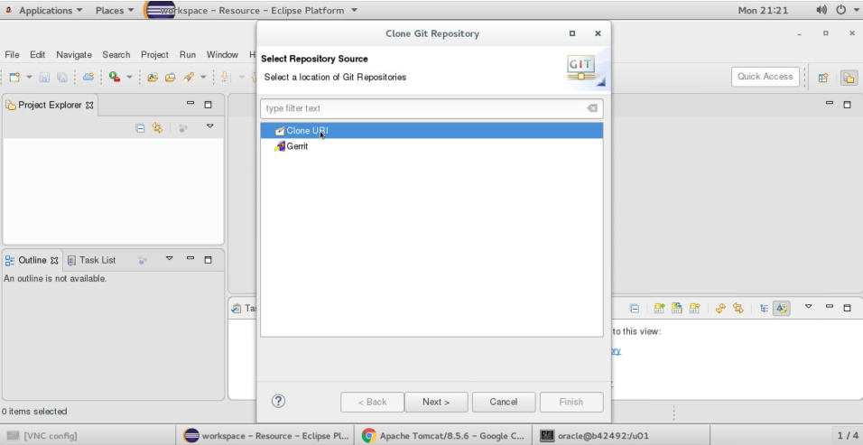
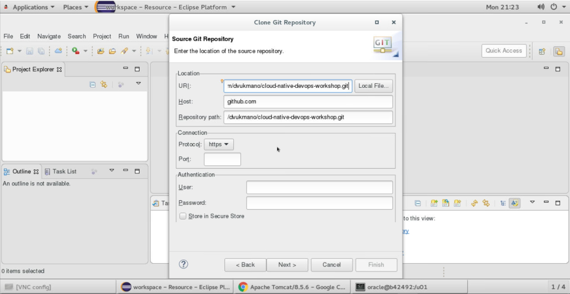
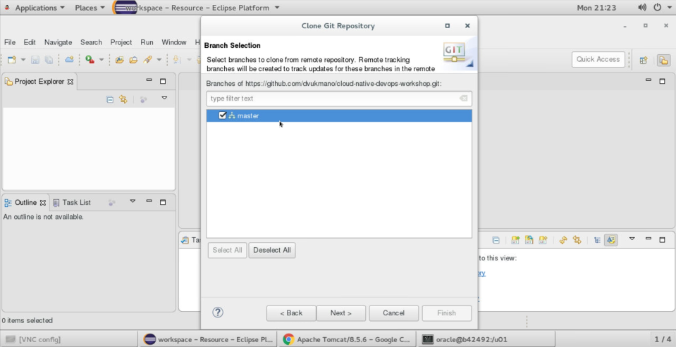
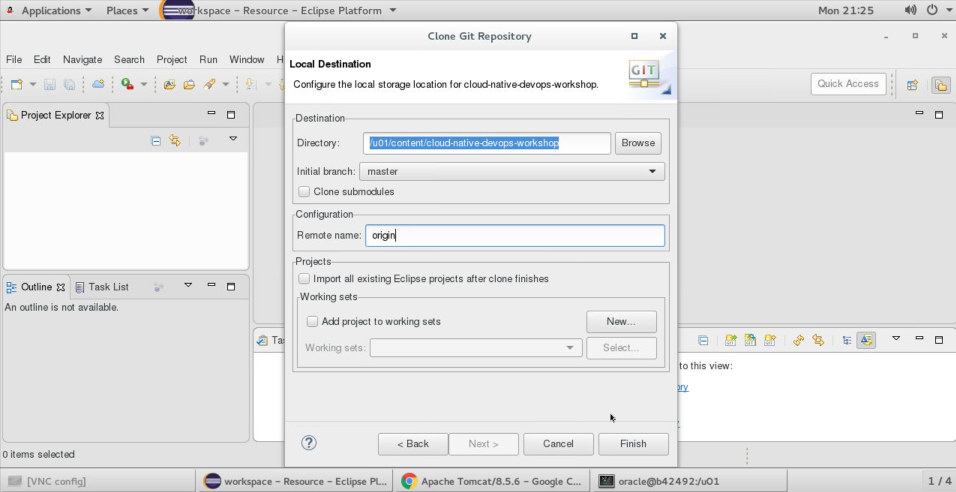

# Setup for Client Image running on compute #

## Local Git clone ##
Before trying any demo, repoitory cloning is required, we will use Git client integrated with Eclipse tool. Statrt Eclipse using shortcut on desktop.

On the toolbar go to Window --> Show View --> Other...

Enter *git* into search field, choose *Git Repositories* and click OK.

Open browser and go to repository on GitHub, https://github.com/dvukmano/cloud-native-devops-workshop. 

Go back to Eclipse and on *Git Repositories* TAB click on **Clone a Git repository**.

Then click on *Clone URI*, Next.

Paste link from github that you copied 3 steps before into field URI, the data should be automatically filled, Next.
- URI: https://github.com/dvukmano/cloud-native-devops-workshop.git
- Host: github.com
- Repository path: /dvukmano/cloud-native-devops-workshop.git

Choose master branch.

Enter local directory, */u01/content/cloud-native-devops-workshop*

Remote server, *origin*, you can leave, Finish.

## Maven  ##
When open terminal window, if you need to run maven, firts check if you can run it with:

    [oracle@b42492 OPCWorkshop]$ mvn --version
    bash: mvn: command not found

If not then add maven to PATH and check again:

    [oracle@b42492 OPCWorkshop]$ export PATH=$PATH:/u01/app/oracle/product/netbeans-8.0.2/java/maven/bin/
    [oracle@b42492 OPCWorkshop]$ mvn --version
    Apache Maven 3.0.5 (r01de14724cdef164cd33c7c8c2fe155faf9602da; 2013-02-19 13:51:28+0000)
    Maven home: /u01/app/oracle/product/netbeans-8.0.2/java/maven
    Java version: 1.8.0_101, vendor: Oracle Corporation
    Java home: /u01/app/oracle/product/jdk1.8.0_101/jre
    Default locale: en_US, platform encoding: UTF-8
    OS name: "linux", version: "4.1.12-61.1.34.el7uek.x86_64", arch: "amd64", family: "unix"
    [oracle@b42492 OPCWorkshop]$ 

## Private Key ##
In order to access provisioned servers using ssh you need private key, the private/public key pair Oracle Cloud created during provisioning of servers.

On the main dashboard click on Navigation Menu.

Go to Storage Classic under Services

On Container list click on **workshopKeys**

Scroll down and you will see private and public key, on private key's Action menu, on the right, click on Download and save it on local folder.

## Python ##
In order to use PSM CLI tool you need to have Python 3.3+, you can check Python version with:
        
        python --version
        
        or
        
        python3 --version

If you need to install newer Python version with pip tool (package management system used to install and manage software packages written in Python) run this commands:

        [oracle@ae42e9 OPCWorkshop]$ sudo yum install python34
        
and then:

        [oracle@ae42e9 OPCWorkshop]$ sudo yum install python34-pip
        
You can check if Python 3.4 was properly installed with:        
        
        [oracle@ae42e9 OPCWorkshop]$ python3 --version

and Python package management 

        [oracle@ae42e9 OPCWorkshop]$ pip3 --version

Now we can install psmcli tool, you can download it using UI or API, UI example is [here](jcs-on-oci-psm/psmcli-setup.md), API example is below:

        [oracle@ae42e9 OPCWorkshop]$ curl -X GET -u cloud.admin:minoR@3BEnding -H X-ID-TENANT-NAME:gse00003442 https://psm.europe.oraclecloud.com/paas/core/api/v1.1/cli/gse00003442/client -o psmcli.zip

You should have now psmcli.zip in yor cuerrnt directory, and now we can istall it:

        [oracle@ae42e9 OPCWorkshop]$ sudo -H pip3 install -U psmcli.zip

Because of two version python on our Client Image we will create a virtual environment for our psm cli in our home directory:

        [oracle@ae42e9 OPCWorkshop]$ pyvenv-3.4 ~/psmclivenv

Now we can activate the virtual environment, where we will have proper version of Python, and invoke the psm cli setup to connect to environment:

        [oracle@ae42e9 OPCWorkshop]$ source ~/psmclivenv/bin/activate
        (psmclivenv) [oracle@ae42e9 OPCWorkshop]$ python --version
        Python 3.4.5
        (psmclivenv) [oracle@ae42e9 OPCWorkshop]$ psm setup
        Username: cloud.admin
        Password: 
        Retype Password: 
        Identity domain: gse00003442
        Region [us]: emea
        Output format [short]: 
        Use OAuth? [n]: 
        ----------------------------------------------------
        'psm setup' was successful. Available services are:
        
        o ADWC : Oracle Autonomous Data Warehouse Cloud
        o ADWCP : Oracle Autonomous Data Warehouse Cloud Platform
        ...
        o jcs : Oracle Java Cloud Service
        o dbcs : Oracle Database Cloud Service
        ...
        o stack : Oracle Cloud Stack Manager
        ----------------------------------------------------
        (psmclivenv) [oracle@ae42e9 OPCWorkshop]$ psm jcs services
        Service       Status  
        Alpha01A-JCS  Ready   
        (psmclivenv) [oracle@ae42e9 OPCWorkshop]$ 

Once you are done with virtual environment, you can deactivate it and will now have access to default python version installed in the machine:

        (psmclivenv) [oracle@ae42e9 OPCWorkshop]$ deactivate
        [oracle@ae42e9 OPCWorkshop]$ 
        [oracle@ae42e9 OPCWorkshop]$ python --version
        Python 2.7.5
        [oracle@ae42e9 OPCWorkshop]$ 

## Alpha2014 passwords ##

weblogic/Alpha2014_

system/Alpha2014_

@PDB1
