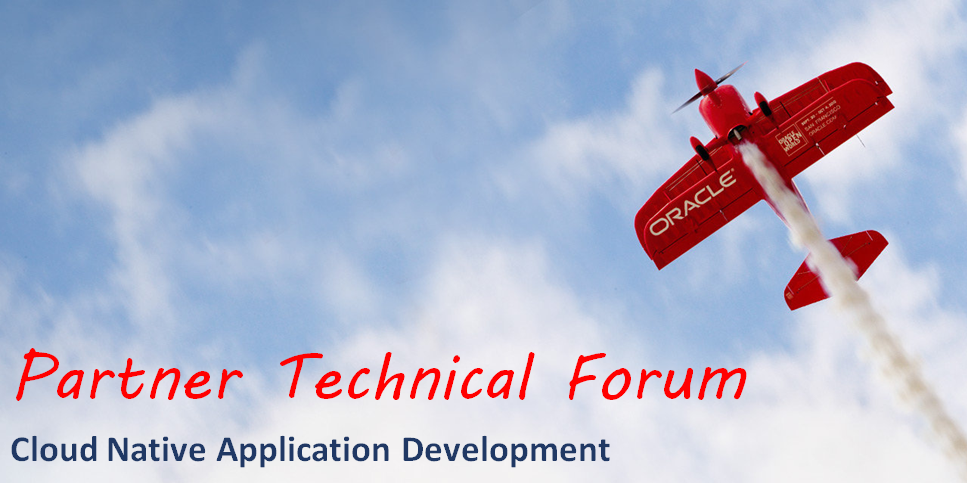

## Prerequisites

#### Client Image vm

This workshop will use Client Image vm provisioned on Oracle Compute with required tools for this workshop. You can use your client environment if you have [required tools](https://github.com/dvukmano/learning-library/blob/PTF-India/workshops/cloud-native-devops-workshop/ClientTools.md).

#### Oracle Public Cloud PaaS  account

The workshop is intended to work with an Oracle GSE account. You should receive email with access details prior to this event. Get the following account details ready to complete the tutorial and replace to your values when it is required:

+ Oracle Cloud account **username** and **password**
+ Oracle Cloud **identity domain**
+ **Data center/region**

---
# ORACLE Cloud-Native DevOps workshop #

## Introduction ##

Oracle Cloud is the industry’s broadest and most integrated public cloud. It offers best-in-class services across software as a service (SaaS), platform as a service (PaaS), and infrastructure as a service (IaaS), and even lets you put Oracle Cloud in your own data center. Oracle Cloud helps organizations drive innovation and business transformation by increasing business agility, lowering costs, and reducing IT complexity. The workshop content shows different aspects of Application Development in the cloud with different set of Oracle Cloud Services.

### Prerequisites ###

Eclipse ??
??

### Important ###

During the execution you will create several public cloud service instances what will be available on the world wide web. Even if these instances are for demo purposes keep in mind it is not a best practice to use weak or known (stored here in the tutorial) passwords especially in such open environment. Thus this workshop content does not recommend any password so you need to define those. You will be asked to provide password at certain points and please remember them  for  later usage.

The content contains several independent modules that cover different aspects of the application development in the Oracle Cloud. These modules could be executed independently unless you find in the Prerequisites that they are dependent on each other.

----
#### Theme : Developer centric approach ####

+ [DevOps JCS Pipeline using Oracle Stack Manager](https://oracle.github.io/learning-library/workshops/jcs-devops/)

#### Theme: Development + Troubleshooting / Monitoring  ####

+ [Deploy Apache Tomcat based application to Oracle Application Container Cloud](accs-tomcat/README.md)
+ [Monitor and tune SpringBoot application deployed on Oracle Application Container Cloud Service](monitor-tune/README.md)
+ [Deploying APM Agent on Apache Tomcat based application and setting up Application Performance Monitoring](apm/README.md)

#### Theme : Admin / IT related ####

+ [Direct access and management of Oracle Java Cloud Service](jcs-direct/README.md)
+ [Scale-Out Oracle Java Cloud Service using user interface](jcs-scale-ui/README.md)
+ [Scale-In Oracle Java Cloud Service using PaaS Service Manager (PSM) Command Line Interface (CLI)](jcs-scale-psm/README.md)
+ [Oracle Java Cloud Service Policy Based Auto Scaling](jcs-autoscale/README.md)
+ [Delete Java Cloud, Database Cloud and Database Container Services using user interface](cleanup/cleanup-ui.md)
+ [Delete Application Cloud Container Service using PaaS Service Manager (PSM) Command Line Interface (CLI)](cleanup/cleanup-psm.md)
+ Deploy complex cloud environment using Oracle Cloud Stack Manager??

---

## [Contributing](../../CONTRIBUTING.md)

## [License](../../LICENSE.md)
