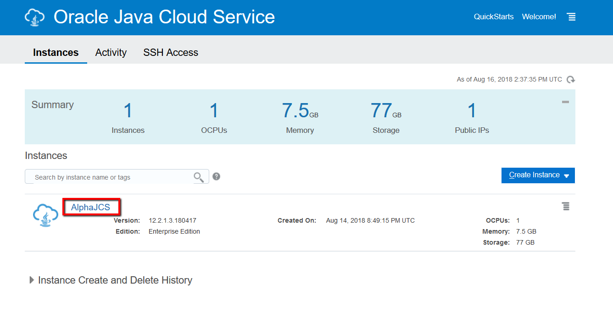
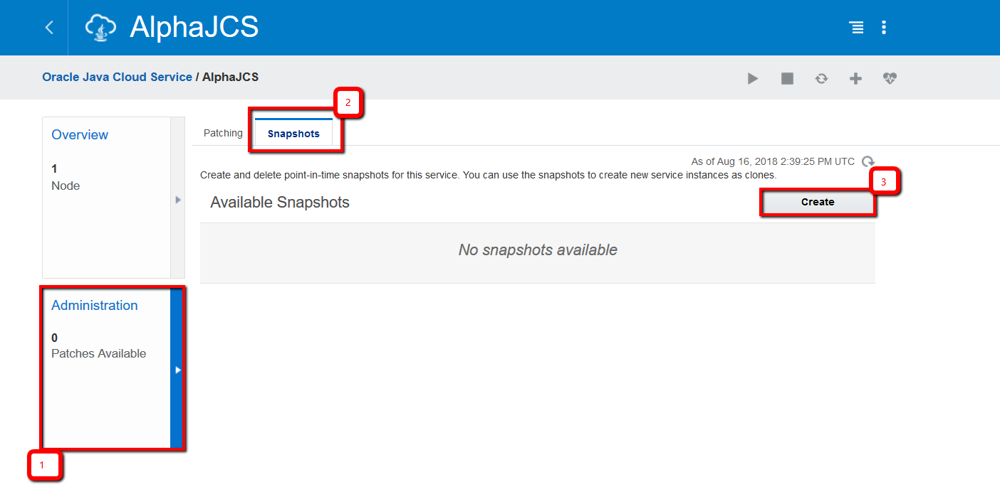
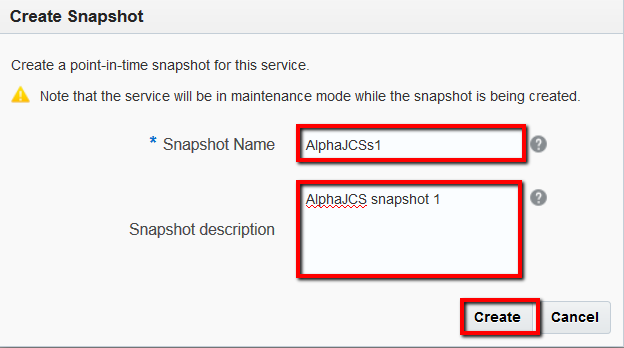
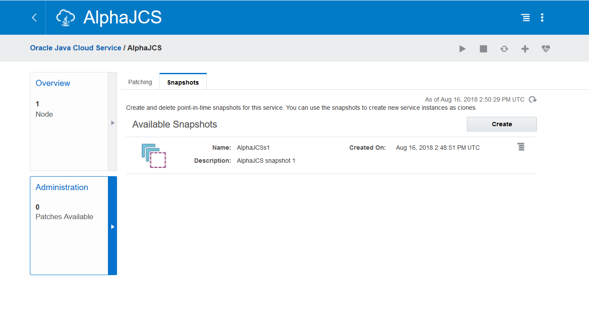
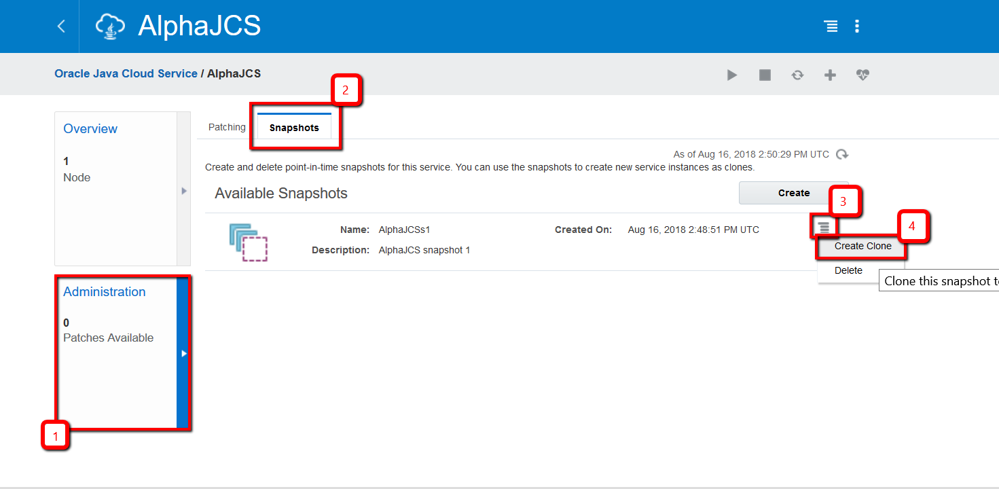
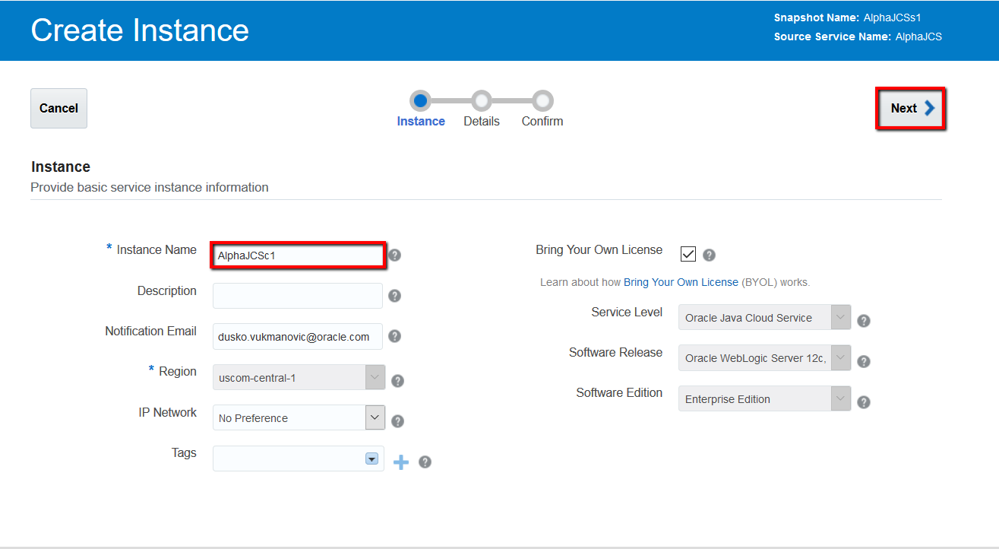
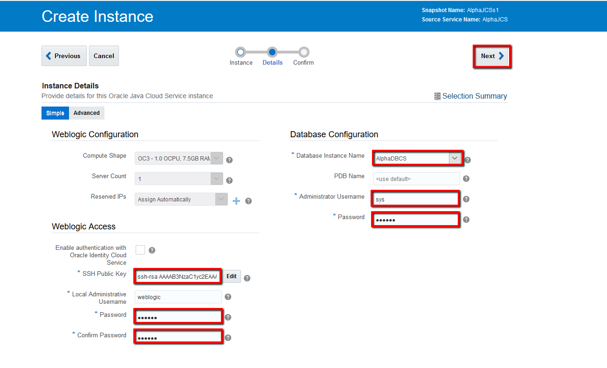
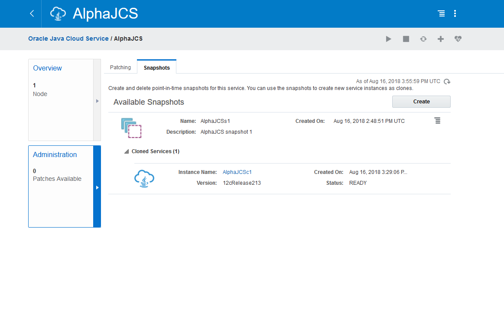
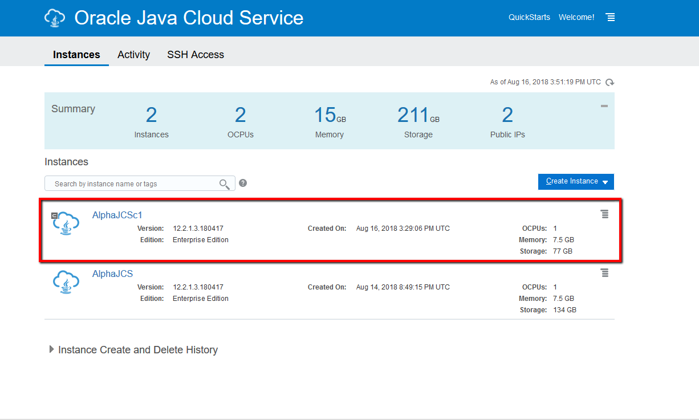

---
# ORACLE Cloud-Native DevOps workshop #
-----
## Oracle Java Cloud Service Snapshot and Cloning ##

### Introduction ###
A snapshot is a point-in-time image of a service instance. You can use snapshots to quickly create multiple clones of an instance. Each clone is a replica of the original instance, except for certain attributes that you specify or override, such as the instance name, the shape of the compute nodes and the SSH public key. To make a clone, user just simply take a snapshot of their service, then using that snapshot to create as many clones as needed. The clone service is identical with the source, from topology to version, custom volumes added...

The snapshot does not include the database associated with the instance. You must take a snapshot of the database separately.

Typical use cases:
+ Move applications from development or testing to production rapidly - After deploying your applications to a service instance and testing them, when the applications are ready for production use, you can take a snapshot of the instance, create a clone of the instance using the snapshot, and then scale the cloned instance to the required size.
+ Debug issues in a production environment without interrupting service availability - Say a web application that’s deployed on one of your service instances has a performance issue. You can take a snapshot of the instance, clone it, and use the cloned instance to diagnose and debug the issue. The production instance continues to be available while your engineers debug the performance issue offline in the cloned instance.

### About this tutorial ###
This tutorial demonstrates how to:

+ Create JCS clone from snapshot

### Prerequisites ###

+ Oracle Public Cloud Services account including:
	+ Database Cloud Service
	+ Java Cloud Service
+ [Create Database Cloud Service Instance using user interface](../dbcs-create/README.md)
+ [Create Java Cloud Service Instance using user interface](../jcs-create/README.md)

### Steps ###

#### Creating a Snapshot of an Oracle Java Cloud Service Instance ####

Sign in the web console and click the name of the instance that you want to take a snapshot of.

Click the Administration tile and then the Snapshots tab, click Create.

In the Create Snapshot dialog box, enter a name and description for the snapshot. Click Create.

In a 3 minutes snapshot will be created.

#### Cloning an Instance Using a Snapshot ####

Sign in to the web console, click the name of the instance that you want to create a clone of, click the Administration tile, click the Snapshots tab, click Menu icon for the snapshot that you want to clone from and click Create Clone. The instance creation wizard starts.

On the Instance page of the wizard, specify the following attributes and click Next (notice that some fields are selected automatically; same as the original instance, cannot be changed):

Instance Name: AlphaJCSc1

On the Instance details page of the wizard, specify the following attributes and click Next:

SSH Public Key: Specify the public key that will be used for authentication when connecting to a node in your instance by using a Secure Shell (SSH) client. Click Edit to display the SSH Public Key for VM Access dialog, and then specify the public key using following method: Select Create a New Key if you want Oracle to generate a public/private key pair for you. You will be prompted to download these generated keys.

Password: Specify a password for the WebLogic Server administrator and confirm the password.

Database Instance Name: Select an existing Oracle Database Cloud Service deployment - AlphaDBCS.

Administrator Username: Enter the name of the database administrator that Oracle Java Cloud Service will use to connect to the selected database deployment and to provision the required schemas for this service instance.

Password: Enter the password for the database administrator (Alpha2018#).

On the Confirmation page, review the attributes you configured and proceed with creating the clone, click Create.

After the clone is created (22 min on OCI-C), the Snapshots tab shows the cloned instance under Cloned Services. 

On the Instances page of the web console, cloned instances are indicated by the different icon.

You can delete cloned JCS instance as any other JCS instance. To delete snapshot, navigate to Snapshots tab, select snapshot and click delete, select OK when confirmation dialog popup.

