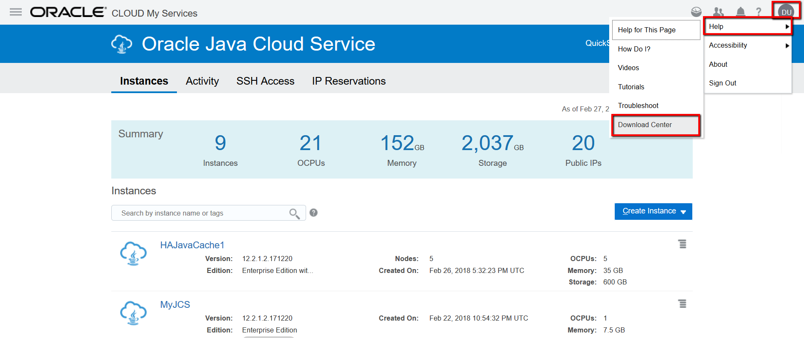
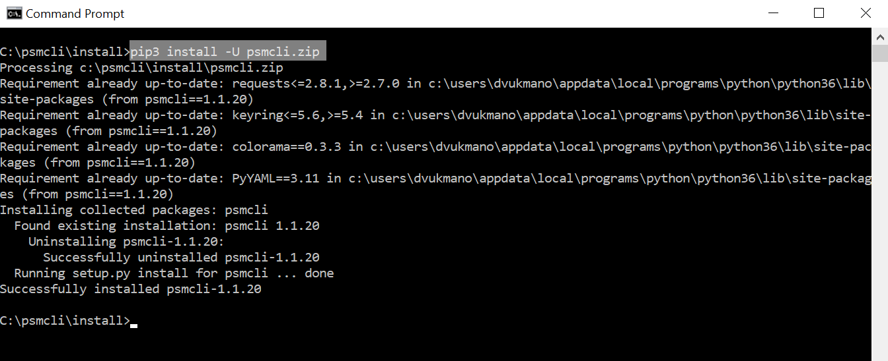
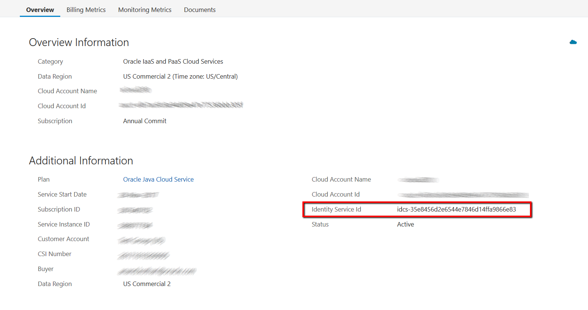

Before PSM CLI setup you must ensure that ypou have appropriate Python version, you can find ***Python*** chapter on [environment setup page](../EnvSetup.md).

### PSM CLI setup ###
Documentation for PSM CLI setup that includes steps for Windows and Linux platform is [here](https://docs.oracle.com/en/cloud/paas/java-cloud/pscli/using-command-line-interface-1.html), I will show here steps for Windows platform.
First, download PSM CLI binaries from any PaaS service console. Click on your username, then help and then Download Center.

On the download page click the download image on the right and follow the instructions to save psmcli.zip into folder on local disk.


Install the PaaS CLI as a Python package. Use the PIP tool pip3 to install the CLI Python package. PIP is already installed if you are using Python 2 >=2.7.9 or Python 3 >=3.4 binaries downloaded from [python.org](https://www.python.org/), if you need to upgrade you can follow this steps for [upgrade pip](https://pip.pypa.io/en/stable/installing/#upgrading-pip).
```
sudo su
>pip3 install -U psmcli.zip
```


First psm command that we are using here to check if psm is available and version is:
```
>psm –v
```


Now we have to connect to Oracle Cloud where we will be manage resources. For this, you can run the setup command, ```psm setup```, and when prompted, enter your cloud user name, password, and identity domain. In order to avoid the prompt-by-prompt routine described above we will use profile. You can create different profiles as JSON files, based on region, credentials, identity domain, and so on and quickly configure your CLI client by passing the profile as a payload. This is helpful if you have multiple configuration profiles (for example, one for each account) as you can use the appropriate profile to access any account.
Before you run psm setup command, if your machine requires a proxy server in order to connect to the Internet, set the http_proxy and https_proxy environment variables.
```
set http_proxy=http://myproxy.oracle.com:80
set https_proxy=https://myproxy.oracle.com:80
```
Below is the example of profile used in this workshop with parameter comments so you cannot copy/paste it as is, remove comment or use source code from here, [oraclecloud-setup.json](payloads/oraclecloud-setup.json).
```
{ 
    "username":" john.smith@example.com", //Username for the account.
    "password":" aZerty12", //Password associated with the specified username.
    "identityDomain":"idcs-35w8456d2e6544e6736s14ffa9866e73", //Identity domain associated with the specified user. If you are configuring your CLI for use with Identity Cloud Service (IDCS), you need to enter your IDCS tenant name rather than your identity domain. The IDCS tenant name is usually a lengthy string of characters preceded by a service ID, for example, idcs-6572bfeb183b4becad9e649bfa14a488. Below are steps to find Identity Domain for IDCS enabled accounts.
    "region":"us", //The cloud data center region”us”, “emea”, “aucom”
    "outputFormat":"short" //Output of psm command, “short”, “json”, “html”
}
```
How to find Identity Domain for IDCS enabled accounts:
To find your IDCS tenant name: when you login, on the Cloud Dashboard page click on any service name, Java in this example.

You will find Identity Service Id on the right side.


Having successfully created profile file and entered data you can run psm command to connect to our cloud account.
```
>psm setup -c oraclecloud-setup.json
```


After successful connection, we are ready for new commands. You can try some of commands below before we start provision environments:
- Description of all commands related to jcs service: ```>psm jcs h```
- List of available services in your account: ```>psm jcs services```
- Description of particular “MyJCS” jcs service: ```>psm jcs service -s MyJCS```
- Checks health of the “MyJCS”service: ```>psm jcs check-health -s MyJCS```

Try those commands also with changing output format to json by adding “-of json” on the end of each command, for example:
```>psm jcs check-health -s MyJCS –of json```

Note that default output was in “short” format since we setup this format in our profile file, if you want to use “json” as default format that you can change this parameter in profile file.

